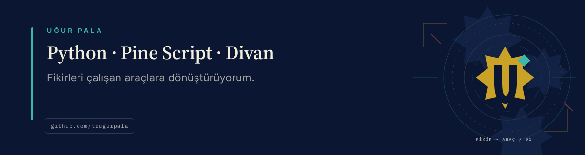

# Merhaba, ben Uğur

Python, Pine Script ve yerel öncelikli araçlarla fikirleri çalışan açık kaynak
projelere dönüştürüyorum. Bu profildeki açık projelerin oluşturulması ve
sürdürülmesinde [Divan](https://github.com/trugurpala/divan) iş akışını
kullanıyorum.

## Divan nedir?

Divan, kullandığınız kodlama ajanına plan, güvenli iş sırası, kalıcı proje
hafızası ve doğrulanabilir teslim ekler. İsteği sınırlar, uygun çalışma
adımlarını seçer, kontrolleri çalıştırır ve sonucun hangi kanıta dayandığını
gösterir.

Divan bir yapay zekâ modeli, bulut kodlama hizmeti veya harici ajan çalışma
zamanı değildir. Claude Code ve Codex gibi desteklenen araçların içinde çalışan
açık kaynak bir beceri ve eklenti dağıtımıdır.

[Divan'ı inceleyin](https://github.com/trugurpala/divan) ·
[Kurulum rehberi](https://github.com/trugurpala/divan#install-with-an-agent) ·
[Web sitesi](https://trugurpala.github.io/divan/)

## Açık kaynak projeler

| Proje | Ne işe yarar? | Durum veya önemli sınır |
|---|---|---|
| [Divan](https://github.com/trugurpala/divan) | Kodlama ajanlarına planlı ve kanıtlı çalışma düzeni ekler. | Ücretsiz, MIT lisanslı; model veya bulut hizmeti değildir. |
| [Pine Script Agent Kit](https://github.com/trugurpala/pinescriptv6) | Yapay zekâ araçlarının Pine Script v6 yanıtlarını adı belli kaynaklara dayandırmasına yardımcı olur. | TradingView derleyicisinin ve gerçek grafik testinin yerini almaz. |
| [Türkiye IBAN](https://github.com/trugurpala/turkiye-iban) | Türkiye IBAN biçimini denetler ve kuruluş kodunu doğrulanmış veriyle eşleştirir. | Bir hesabın varlığını veya sahibini doğrulamaz. |
| [Türkiye IBAN — PHP](https://github.com/trugurpala/turkiye-iban-php) | Türkiye IBAN işlemleri için PHP 8.2+ Composer istemcisi sunar. | Çalışırken ağdan veri indirmez. |
| [Türkiye IBAN — Python](https://github.com/trugurpala/turkiye-iban-python) | Türkiye IBAN işlemleri için Python 3.10+ istemcisi sunar. | Çalışırken ağdan veri indirmez. |
| [Ada Su](https://github.com/trugurpala/ada-su) | Hesap, reklam ve analiz kullanmayan mobil öncelikli bir su hatırlatıcısıdır. | Veriler tarayıcıda kalır. |

Her projenin kurulum, destek, güvenlik ve lisans sınırları kendi deposunda
açıklanır. Sorunuz veya öneriniz varsa ilgili projenin destek bağlantısını
kullanın; profil hakkında bir düzeltme için
[katkı rehberine](CONTRIBUTING.md) bakın.

## İletişim

[X](https://x.com/trugurpala) ·
[E-posta](mailto:mail@ugurpala.com) ·
[Topluluk kuralları](CODE_OF_CONDUCT.md) ·
[Güvenlik bildirimi](SECURITY.md)

Bu profil deposunun içeriği [MIT Lisansı](LICENSE) ile paylaşılır.

English: I build open-source tools with Python and Pine Script. My public
projects use Divan to turn scoped work into plans, checks and evidence-backed
delivery.
