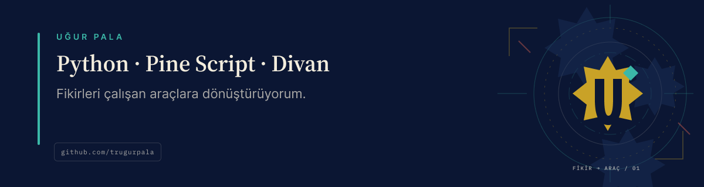

  <strong>Türkçe</strong> · <a href="./README.en.md">English</a>

# Merhaba, ben Uğur Pala

Fikirleri yapay zekâ destekli kodlama araçlarıyla açık kaynak projelere
dönüştürüyorum. Kendimi bir *vibe coder* olarak tanımlıyorum: ne yapmak
istediğimi, kimin için yaptığımı ve sınırlarını belirliyor; kodlama ajanlarıyla
birlikte adım adım geliştiriyorum.

İlgi alanlarım; kodlama ajanlarıyla üretim, yerel çalışan araçlar, Python,
Pine Script ve günlük bir ihtiyacı çözen sade uygulamalar.

## Nasıl çalışıyorum?

- **Önce ihtiyacı netleştiriyorum.** Fikri, kapsamı ve beklenen sonucu belirliyorum.
- **Küçük adımlarla ilerliyorum.** Planlama, uygulama ve kontrolü birlikte ele alıyorum.
- **Sonucu kontrol ediyorum.** Neyin test edildiğini ve neyin hâlâ doğrulanması gerektiğini açık tutuyorum.
- **Ürettiklerimi paylaşıyorum.** Projelerimi kaynak kodu ve kullanım belgeleriyle yayımlıyorum.

## Üzerinde çalıştığım projeler

### Kodlama ajanlarıyla üretim

**[Divan](https://github.com/trugurpala/divan)**

Codex için doğal dille kullanılan bir mühendislik eklentisi. Projeyi inceleme,
planlama, hatanın kök nedenini bulma ve yapılan işi kanıtlarıyla kontrol etme
adımlarını bir araya getirir.

[Kurulum ve kullanım](https://github.com/trugurpala/divan#install)

**[Pala · Project Studio](https://github.com/trugurpala/pala-project-studio)**

Bir fikirden veya mevcut depodan başlayıp planlama, uygulama, kalite kontrolü
ve yayıma hazırlığı yöneten yerel öncelikli yazılım geliştirme ortamı.
Proje durumu ve kontrol kanıtları varsayılan olarak yerelde tutulur;
yapay zekâ sağlayıcıları değiştirilebilir.

[Başlangıç rehberi](https://github.com/trugurpala/pala-project-studio/blob/main/docs/VIBE_FIRST_SESSION.md)

### Geliştirici araçları ve açık veri

| Proje | Ne için kullanılır? |
| --- | --- |
| [Pine Script Agent Kit](https://github.com/trugurpala/pinescriptv6) | Kodlama ajanlarına Pine Script v6 için kaynakları belirtilmiş rehberlik ve örnekler sağlar. |
| [Türkiye IBAN](https://github.com/trugurpala/turkiye-iban) | Türkiye IBAN biçimini doğrular; kuruluş kodlarını TCMB kaynaklı veriyle eşleştirir. Açık veri ve TypeScript/NPM paketi sunar. |
| [Türkiye IBAN · PHP](https://github.com/trugurpala/turkiye-iban-php) | PHP 8.2+ için IBAN doğrulama, biçimlendirme, maskeleme ve kuruluş kodu eşleştirmesi. |
| [Türkiye IBAN · Python](https://github.com/trugurpala/turkiye-iban-python) | Python 3.10+ için aynı IBAN işlemlerini sunan istemci. |

Pine Script sonuçları TradingView üzerinde ayrıca kontrol edilmelidir.
IBAN araçları hesabın varlığını veya sahibini doğrulamaz.

### Günlük hayata küçük bir araç

**[Ada Su](https://github.com/trugurpala/ada-su)**

Hesap açmadan kullanabileceğiniz, reklamsız bir su hatırlatıcısı.
Verileriniz tarayıcınızda kalır; hatırlatmalar sayfa açıkken çalışır.

[Ada Su'yu deneyin](https://trugurpala.github.io/ada-su/)

## İletişim ve katkı

Bir proje hakkında sorunuz, öneriniz veya hata bildiriminiz varsa ilgili
deponun destek ve katkı rehberinden başlayabilirsiniz. İşinize yarayan
projeye yıldız vermeniz veya katkıda bulunmanız da destek olur.

[E-posta](mailto:mail@ugurpala.com) · [X / @trugurpala](https://x.com/trugurpala)

---

[Profile katkı](CONTRIBUTING.md) · [Topluluk kuralları](CODE_OF_CONDUCT.md) ·
[Güvenlik politikası](SECURITY.md) · [MIT Lisansı](LICENSE)
